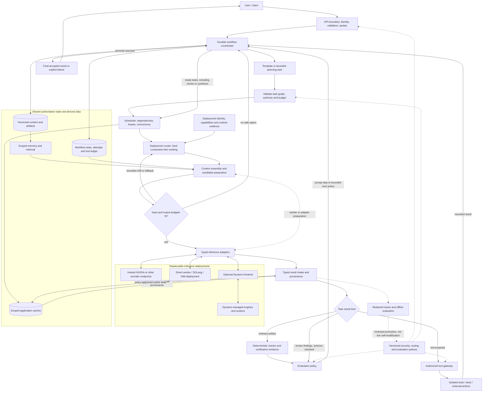
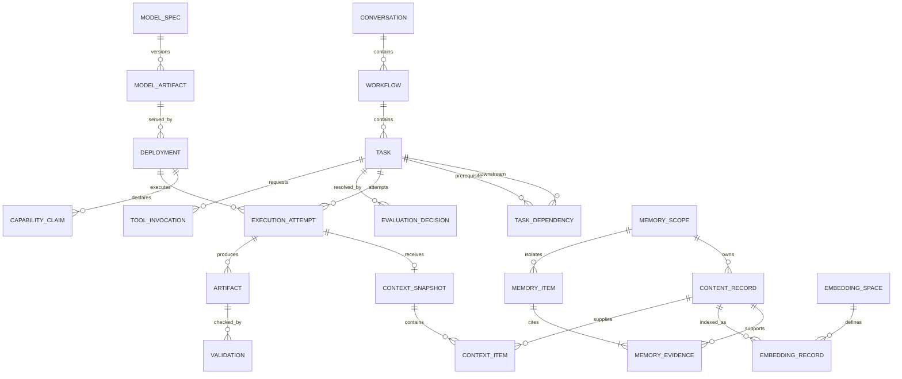
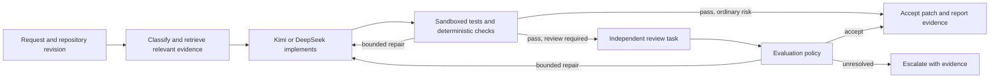

# Ryuk Architecture Design

**Date:** 2026-09-01
**Status:** Proposed target architecture; not an implementation or production certification
**Scope:** Multi-model orchestration, inference serving, context engineering, persistent memory, specialist ingestion, verification, security, and operations
**Reviewed repository:** `/home/sudosu/projects/ryuk`, HEAD `04a113884bedacaeb7d4d0a19538c387736fc6b4`
**Baseline:** `ARCHITECTURE_REVIEW.md`, dated 2026-08-31, reviewing commit `158767e`

## 1. Executive decision

Ryuk should own a durable, policy-controlled workflow above its existing inference router. It should select appropriate model deployments for individual tasks, assemble model-specific context, execute within explicit permissions and budgets, verify results, and retain scoped evidence and task state across model changes and restarts.

The user interacts with Ryuk, not a collection of disconnected model sessions. Kimi K3 is the preferred primary multimodal/general candidate, and Kimi K3 plus DeepSeek V4 are coding candidates. These are configurable starting preferences, not permanent dependencies or proven performance rankings.

The central invariant is:

> Ryuk owns task semantics, continuity, authority, and acceptance. Models contribute capabilities. Serving runtimes own inference execution within their deployment boundary.

Begin with a modular controller, transactional state, artifact storage, and separate inference/tool workers. The logical components below do not require separate microservices. Add distributed coordination only when deployment scale requires it.

## 2. Evidence and relationship to existing documents

### 2.1 Sources and interpretation

This design consolidates the project documents previously read in this conversation: `AGENTS.md`, `ARCHITECTURE_REVIEW.md`, `IMPLEMENTATION_PLAN.md`, `PROJECT_STATUS_REPORT.md`, `README.md`, `pyproject.toml`, dependency lists, and the user-owned `llms.md`. It also incorporates the user's hand-drawn orchestration diagram and NVIDIA/model research.

The architecture review and agent instructions were reread for this design. Current domain contracts and repository status were checked. Earlier source inspection in this conversation covered the API, router, context capability checks, vLLM worker, records, advanced task contracts, and ADR-001/006/007/008. This is a scoped architectural review, not a fresh exhaustive code audit.

The old review's statements that tests are absent, README is empty, and several adapters are placeholders describe its historical commit. They must not be copied as current findings. The later status report records 163 tests passing and four skipped integrations; those tests were **not rerun for this document**. Existence of code or a reported test count does not establish production readiness.

The project working tree was clean at inspection. No project code, existing architecture documents, or `llms.md` were changed.

### 2.2 Crosswalk against all original findings

| Original review finding | Design response | Current evidence / remaining work |
| --- | --- | --- |
| 1. False model attribution | Separate requested model, registered artifact, observed identity, and verification level | Identity/provenance foundation exists; hosted attestation and activation remain deployment-specific |
| 2. No generation-time failover | Preserve typed attempts and deadlines; add workflow-level recovery and bounded semantic retries | Inference attempt foundation exists; durable workflow recovery is new |
| 3. Flat engine list | Route to a composed deployment, not a generic engine name | Extend existing deployment references without flattening Dynamo or NIM |
| 4. Engine-only capabilities | Evidence-bearing claims for exact deployment/profile, separate from runtime state | Existing capability checks are the foundation; specialist profiles need certification |
| 5. Completion-specific contract | Typed generation, tools, media, ASR, OCR/layout, embedding, and rerank variants | Text/chat and advanced groundwork exist; not all variants are end-to-end |
| 6. Production mock fallback | Refuse production mock registration; label synthetic results | Preserve existing containment and regression tests |
| 7. Sequential health checks | Background bounded probes, freshness policy, isolated failures | Runtime collector exists; production observation coverage remains a gate |
| 8. Weak failure semantics | Keep normalized failures; distinguish transport retry from semantic repair and uncertain side effects | Extend, do not replace, existing error/attempt model |
| 9. Missing tests/evaluation | Contract, routing, workflow, memory, security, and real-deployment evaluations | Tests/evaluation modules now exist; new workflows require new evidence |
| 10. Minimal API controls | Authenticate and authorize every path; admit workflow and nested work | Security/admission primitives exist; generation-path integration remains necessary |
| 11. Transport limitations | Lifecycle-managed async adapters; bounded responses, cancellation, pooling | Preserve later adapter work; certify each actual endpoint contract |
| 12. Global registry construction | Explicit deployment definitions and injectable registries/policies | Avoid adding another hidden global model catalog |
| 13. Engineering foundation | Maintain dependency separation, documentation, CI, fixtures, and release gates | Later repository supersedes historical absence claims; validate changes normally |

### 2.3 Corrections to our earlier sketches

1. A `MODEL -> DEPLOYMENT` pair alone is too coarse. Preserve model specification, artifact, engine version, runtime topology, compute pool, and immutable deployment configuration.
2. `X+Y` and `X+Y+Z` are workflows, not models or engines.
3. A generic result-to-review loop could accidentally review the reviewer forever. Review tasks are explicitly typed, associated with a target artifact, and bounded by policy.
4. Cache hits must enter the same result validation and provenance path as fresh results; they cannot jump directly to user delivery.
5. Review findings are not acceptance. Only evaluation policy commits the accept/repair/reroute/escalate decision.
6. An execution log is not sufficient for workflow recovery. State transitions, leases, event ordering, idempotency, and tool-action reconciliation are required.
7. Embedding generation and reranking are scheduled inference work, not invisible free operations inside a database.
8. The earlier ER sketch used simplified foreign keys. The implementation schema must enforce tenant-qualified relationships, scope authorization, evidence versioning, and non-cyclic task dependencies.

## 3. Non-negotiable boundaries

- Ryuk-owned contracts remain the internal language; external SDK/protocol objects stay inside adapters.
- Prefer native engine interfaces where appropriate. A supported OpenAI-compatible external interface is acceptable within a dedicated adapter, as the review explains; it is not the core abstraction.
- A model's marketing description is not a verified endpoint capability. Unknown hard requirements fail closed.
- The controller must not import CUDA, PyTorch, vLLM, or heavy model-tokenizer dependencies merely to serve the API.
- Models cannot grant permissions, reveal credentials, modify policy, or authorize new tools.
- All nested model work, including planning, review, summarization, embedding, and reranking, consumes the same workflow budget and is auditable.
- Persistent source content, selected memory, working state, application caches, and serving KV cache are distinct.
- Privacy, residency, and capability constraints never become soft scores that a faster model can override.
- No guarantee of factual correctness follows from model agreement, a large context window, or a successful HTTP response.

## 4. Target logical architecture



Arrows describe logical interactions, not necessarily individual network services. A model-assisted planner is itself scheduled through the normal execution path using a bounded bootstrap template. A deterministic template needs no planning call. Neither planner invokes providers directly.

All generation endpoints, including legacy compatibility paths, must enforce the same server-owned principal, access policy, and admission rules. Direct inference may remain available as a governed single-task operation; it must not bypass security because it does not need a multi-step workflow.

## 5. Domain model and ownership

| Domain concept | Responsibility |
| --- | --- |
| `Principal`, `MemoryScope` | Server-established identity and tenant/project/user access rules |
| `Conversation`, `Message` | Durable interaction history with content references and retention |
| `Workflow`, `Task`, `TaskDependency` | Objective, acceptance criteria, task graph, progress and terminal state |
| `ExecutionAttempt` | One actual model invocation with deployment, deadline, outcome and usage |
| `ModelSpec` | Family/architecture and candidate task characteristics |
| `ModelArtifact` | Exact revision, tokenizer/template, quantization and integrity identity where available |
| `Deployment` | Artifact plus engine/runtime/configuration/compute location and endpoint |
| `CapabilityClaim` | Value, evidence source, verification state and expiry |
| `ObservedRuntimeState` | Timestamped readiness, queue, load, latency and health, not transaction truth |
| `TaskPacket`, `ContextSnapshot` | Bounded input and reproducible input references for one candidate execution |
| `Artifact`, `Validation`, `AuditReport` | Produced evidence and checks against a specific artifact revision |
| `EvaluationDecision` | Versioned accept/revise/regenerate/verify/reroute/escalate decision |
| `MemoryItem`, `MemoryEvidence` | Scoped claim with provenance, corrections and lifecycle |
| `EmbeddingSpace`, `EmbeddingRecord` | Versioned derived representations and chunk references |
| `ToolInvocation` | Authorized action, idempotency key, effect classification and reconciled outcome |
| `CacheEntry` | Scoped reusable result with source/configuration fingerprints and expiry |

These names describe target concepts; reuse or extend existing contracts rather than creating competing versions. In particular, retain the current inference envelope and `DeploymentRef` compatibility while evolving them.

### 5.1 Core relationships



This is a conceptual ER view, not a complete migration. A cache reuse is recorded as a task event referencing its original artifact/attempt, not fabricated as a new model invocation. Hosted deployments may require a logical artifact record with explicitly unknown digest/runtime/hardware; do not invent inaccessible details.

Database constraints must ensure tenant-qualified references, same-workflow dependency membership, immutable artifact revisions, unique attempt sequence numbers, and valid state transitions. Acyclicity and authorized cross-scope sharing require transactional application checks as well as database constraints.

## 6. Workflow execution and recovery

### 6.1 Supported strategies

- Single specialist: one suitable model executes a task.
- Sequential pipeline: one accepted artifact feeds the next task.
- Parallel independent tasks: independent inputs/outputs are executed concurrently under a shared budget.
- Generator plus reviewer: the reviewer examines a specific version, with conflicts handled by evaluation policy.
- Escalation: a failed acceptance check justifies a more capable candidate or human decision.

A planner can propose a task graph but a validator enforces allowed task kinds, dependency structure, resource budgets, data access, and termination. Do not enable arbitrary recursive delegation in the first slice.

### 6.2 Durable transitions

Persist pending, ready, running, waiting-for-tool/review/approval, succeeded, failed, cancelled, and blocked states with transition versions. An inference call succeeding is not the same as its task being accepted.

Reserve a lease and budget before dispatch. Record attempts and outcomes transactionally; use an outbox or equivalent when publishing committed work to an external queue. A local scheduler can initially claim work directly from transactional state. Use fencing/version checks so expired workers cannot overwrite newer outcomes.

Recovery reads authoritative state, reconciles uncertain work, and schedules only eligible unfinished tasks. Do not rely on an in-memory queue, monitoring metrics, or the last assistant message as the resume record.

### 6.3 Retry and cancellation ownership

The inference router owns bounded transport attempts within an allocated task budget. The coordinator owns semantic repair and workflow progression. Do not let adapter, router, scheduler, and reviewer retries multiply independently.

Cancellation propagates through queued tasks, active inference, tools, and streaming. When an external service cannot guarantee cancellation, record the uncertain/late outcome and reconcile usage; do not claim the work stopped merely because the client disconnected.

For external side effects, record intent before dispatch, use provider-supported idempotency when available, and reconcile ambiguous outcomes before retrying. Exactly-once side effects are not guaranteed by ordinary queues or database logs.

### 6.4 Streaming

Distinguish provisional model deltas from an accepted final answer. A stream interruption must not silently concatenate output from another model. Restart with a new attempt identity or report interruption. Delay high-risk final delivery until required verification; never execute partial streamed tool arguments.

## 7. Task routing and model collaboration

### 7.1 Selection pipeline

1. Derive typed requirements from user intent, workflow policy, modalities and acceptance criteria.
2. Identify allowed models/artifacts and eligible deployments.
3. Reject missing capabilities, prohibited locations, unacceptable identity evidence, stale hard-constraint claims, and unavailable capacity.
4. Assemble bounded candidate-specific context and validate actual input/output limits.
5. Rank eligible candidates using measured task quality, latency, cost and reliability, with explicit uncertainty.
6. Reserve resources and execute; record candidate rejections, selected profile and attempt identity.
7. Validate, audit where useful, and let evaluation policy decide the next transition.

Candidate context preparation is bounded: shortlist first, then prepare candidates as necessary. Health checks and tokenization for every catalog model must not become an unbounded request-path tax. Unknown cost or quality is not zero cost or high quality.

### 7.2 Initial Kimi–DeepSeek coding workflow

Kimi K3 is a preferred candidate for multimodal interpretation and coding involving screenshots. DeepSeek V4 and Kimi K3 are eligible text-coding candidates once their endpoint profiles pass contract tests. Neither must run on every request.



Use isolated working copies or patches against a pinned base revision. Parallel workers must not mutate the same repository checkout. Integrate changes under coordinator control and rerun relevant checks on the integrated result. A reviewer cannot approve an earlier artifact revision after the patch changes.

Every handoff includes the objective, relevant source revisions, allowed tools, expected output, acceptance checks, completed work, unresolved questions and remaining budget. Do not exchange private reasoning traces as the portable memory mechanism. Provider-required continuation fields, if any, remain adapter-local and governed separately.

## 8. Context engineering

### 8.1 Context is an execution product, not the conversation database

Retain separate durable conversation history, structured working state and selected persistent memories. Build one task packet for each call from authorized subsets of those sources.

Keep trusted system constraints, the current objective and acceptance criteria explicit. Select recent relevant turns, source excerpts, code symbols, tool results and checkpoints. Mark retrieved material and generated summaries as evidence, never as new authority.

### 8.2 Budgeting and preparation contract

For autoregressive generation candidates, enforce the deployment's documented accounting rules:

```text
formatted input tokens + reserved generated tokens + safety margin <= context capacity
generated-token reserve <= endpoint output limit
input/media sizes <= endpoint-specific input limits
```

Reasoning may consume the generated-token budget depending on the endpoint. Media accounting may require pixels, frames, duration, byte limits and model-specific token costs. Embedding, ASR and detector tasks use their own typed limits rather than this generation formula.

Add a Ryuk-owned preparation result containing deployment/profile revision, tokenizer/template provenance, input counts, count method, media constraints, reserved output, expiry and a digest of the prepared payload. Execution must use the same payload/configuration, or reprepare to prevent counting one prompt and sending another.

Exact tokenization and formatting belong at the worker/adapter boundary. For hosted services without exact counting, use a labeled conservative estimate and contract-tested margins. Where strict fit cannot be established, fail safely or reduce the input; do not misrepresent an estimate as a guarantee.

On fallback, recheck capabilities, formatting, tools, reasoning settings and budgets. Token counts, KV state and serialized chat formats are not portable between models.

### 8.3 Compaction

Trigger compaction based on the task budget and measured retrieval quality, not simply when the maximum window is almost full. Prefer dropping irrelevant/redundant material and retrieving targeted sources before summarizing everything.

Checkpoint summaries retain source references, decisions, constraints, open questions and a schema/version. Preserve original sources subject to retention policy. Verify critical extracted facts against source material; avoid repeatedly summarizing only the previous summary. A compaction job is itself budgeted, scoped inference work.

Large context windows are ceilings, not quality guarantees. Long-context effects differ across models and tasks; test Ryuk's repository and document workloads rather than generalizing one paper to every model. [Original long-context study](https://arxiv.org/abs/2307.03172), [later retrieval study](https://research.google/pubs/retrieval-quality-at-context-limit/).

## 9. Persistent memory and retrieval

### 9.1 Storage layers

| Layer | Stores | Authority |
| --- | --- | --- |
| Transactional workflow store | Conversations, tasks, decisions, attempts, checkpoints, action ledger | Workflow state of record |
| Content/artifact store | Original media, versioned documents, patches, tool outputs, reports | Source evidence with access/retention policy |
| Memory store | Selected facts, preferences and decisions with citations | Claims with explicit verification/lifecycle |
| Search index | Lexical entries and vectors linked to source chunks | Rebuildable derivative |
| Application cache | Eligible result, embedding and retrieval reuse | Disposable acceleration |
| Serving KV cache | Runtime-specific prefix/intermediate state | Disposable inference acceleration |

### 9.2 Memory lifecycle

Use project-scoped memory by default, with user preferences explicitly scoped and cross-project sharing opt-in. All access remains tenant-bound and policy-authorized.

Memory writes follow candidate extraction, secret/sensitive-data policy, provenance checks, conflict handling and approval rules. Not every message or accepted answer becomes a durable fact. Track source authority and distinguish user statements, measured observations and model hypotheses.

Each memory item has scope, statement/type, evidence references, source revisions, verification status, timestamps, expiry, sensitivity, supersession and deletion state. Corrections supersede earlier claims without silently erasing necessary audit history. Audit retention does not justify retaining prohibited sensitive payloads.

Deletion and permission changes invalidate memory visibility, derived embeddings, retrieval/result caches and retained snapshots as policy requires. Restore procedures must reapply tombstones and access changes before serving restored indexes. Already disclosed data cannot be recalled from a recipient; retention at hosted providers is an explicit deployment-policy concern.

### 9.3 Ingestion and retrieval

Ingestion is a workflow: authorized source -> parsing or specialist ASR/OCR/layout -> normalized content -> chunking -> indexing. Preserve page coordinates, audio timestamps, document revision and code symbol locations.

Use lexical and vector retrieval as complementary tools, followed by optional reranking. Filter authorized scope before ranking and recheck returned source access before prompt assembly. Embedding and reranking calls inherit data-residency constraints; sending a document to an embedding endpoint is still disclosure.

Version each embedding space by model/encoder revision, preprocessing, dimensions, normalization and distance metric. Query and passage modes must be correct. Do not mix unrelated embedding spaces merely because dimensions match. Build a new index and evaluate before switching versions; retain source content for reindexing.

NeMo Agent Toolkit's documented memory integrations are optional adapter candidates, not Ryuk's memory authority. Do not import automatic save-every-interaction behavior without retention and consent policy. [NVIDIA memory documentation](https://docs.nvidia.com/nemo/agent-toolkit/latest/build-workflows/memory.html).

## 10. Cache correctness

Cache keys include authorized scope, policy/access epoch, task type, source revisions, prepared input fingerprint, model/deployment/profile, sampling/reasoning settings, tools, output schema and validator version as appropriate. Keys and logs must not reveal raw secrets; use controlled fingerprints where sensitive inputs are involved.

Reuse requires freshness, compatible semantics and access checks. Preserve the original model/result provenance and record the new reuse event separately. Revalidate under the current acceptance policy. Cache hits do not execute tool side effects again and do not count as new inference.

Semantic answer caching is opt-in and initially excluded for mutable repository edits, personalized/private answers and side-effecting tasks. KV caching remains under the serving runtime's isolation and compatibility rules, not under semantic-memory APIs.

## 11. Specialist model portfolio

The following table consolidates all **21 unique model names** supplied by the user. Repeated Kimi, embedding and Cosmos entries are deduplicated. Roles are proposed evaluation targets, not claims of benchmark superiority or authenticated account access. Public catalog/API research was performed during this conversation on 2026-09-01; exact contracts must be rechecked at activation.

| Model | Proposed role | Integration and qualification note |
| --- | --- | --- |
| `moonshotai/kimi-k3` | Primary multimodal/general candidate; planning, coding, synthesis | Image/chat/tools profile; validate exact endpoint semantics |
| `deepseek-ai/deepseek-v4-pro-0813` | Text coding, debugging and independent alternatives | Tool-call support must be tested; do not infer it from coding strength |
| `nvidia/parakeet-ctc-0.6b-asr` | Speech transcription candidate | Dedicated ASR contract; evaluate language, timestamps and recording quality |
| `nvidia/parakeet-ctc-1.1b-asr` | Alternative ASR candidate | Compare accuracy and end-to-end latency rather than assuming size determines speed |
| `nvidia/nemotron-3-nano-omni-30b-a3b-reasoning` | Smaller multimodal specialist candidate | Verify each exposed audio/image/video mode independently |
| `meta/llama-3.2-11b-vision-instruct` | Image interpretation baseline | Research environment encountered location restriction; user's access remains unknown |
| `meta/llama-3.2-90b-vision-instruct` | Larger image interpretation baseline | Benchmark against Kimi and smaller vision alternatives |
| `google/paligemma` | Narrow image question answering/captioning | Dedicated VLM interface; not a general tool agent |
| `nvidia/nemotron-table-structure-v1` | Table structure extraction | Detect structure, combine with OCR and coordinate mapping |
| `nvidia/nemotron-page-elements-v3` | Page layout segmentation | Document regions, not general-world object detection |
| `nvidia/nemotron-graphic-elements-v1` | Chart/graphic element extraction | Preserve geometry and source page references |
| `nvidia/nemotron-ocr-v2` | OCR | Preserve language/coordinate evidence; self-host API varies by release |
| `nvidia/nemotron-3-embed-1b` | Text/code semantic retrieval candidate | Separate query/passage modes and versioned index |
| `nvidia/llama-nemotron-embed-vl-1b-v2` | Multimodal retrieval candidate | Catalog vs hosted image-payload documentation gap requires testing |
| `nvidia/llama-nemotron-rerank-vl-1b-v2` | Retrieved candidate reranking | Dedicated rerank contract; explicit truncation policy |
| `meta/muse-glimmer-30b` | Routine multimodal/tool workload candidate | Record reasoning/output accounting and sampling profile |
| `meta/llama-guard-4-12b` | Safety classification signal | Not a factual auditor, authorization engine or complete security boundary |
| `nvidia/nemotron-3-super-120b-a12b` | Reasoning/coding escalation candidate | MoE is model architecture, not a task kind or performance guarantee |
| `nvidia/nemotron-3-ultra-550b-a55b` | Difficult-task escalation candidate | Admit only if measured benefit justifies resource cost |
| `google/diffusiongemma-26b-a4b-it` | Experimental language/multimodal candidate | Diffusion language model, not an image-generation assignment |
| `nvidia/cosmos3-nano-reasoner` | Video/physical-world interpretation candidate | Hosted video submission contract still needs verification |

### 11.1 Endpoint families and source references

| Family | Research snapshot | Primary reference |
| --- | --- | --- |
| Most listed chat generators | `POST https://integrate.api.nvidia.com/v1/chat/completions` with exact model/profile | [Kimi API](https://docs.api.nvidia.com/nim/re/reference/moonshotai-kimi-k3-infer), [DeepSeek API](https://docs.api.nvidia.com/nim/reference/deepseek-ai-deepseek-v4-pro-0813-infer) |
| Llama 11B vision | Documented dedicated `/v1/meta/llama-3.2-11b-vision-instruct` path | [API](https://docs.api.nvidia.com/nim/reference/meta-llama-3_2-11b-vision-instruct-infer) |
| PaliGemma | `https://ai.api.nvidia.com/v1/vlm/google/paligemma` | [API](https://docs.api.nvidia.com/nim/reference/google-paligemma-infer) |
| Parakeet | gRPC TLS `grpc.nvcf.nvidia.com:443`; model-specific function metadata | [0.6B API](https://build.nvidia.com/nvidia/parakeet-ctc-0_6b-asr/api), [1.1B API](https://build.nvidia.com/nvidia/parakeet-ctc-1_1b-asr/api) |
| Document CV | Hosted `/v1/cv/nvidia/` model-specific routes | [Extraction support matrix](https://nvidia.github.io/NeMo-Retriever/extraction/prerequisites-support-matrix/), [RAG client](https://docs.nvidia.com/rag/latest/python-client.html) |
| Embeddings | `https://integrate.api.nvidia.com/v1/embeddings` | [Text embedding API](https://docs.api.nvidia.com/nim/reference/nvidia-nemotron-3-embed-1b-infer), [VL API](https://docs.api.nvidia.com/nim/reference/nvidia-llama-nemotron-embed-vl-1b-v2-infer) |
| Reranking | `https://ai.api.nvidia.com/v1/retrieval/nvidia/llama-nemotron-rerank-vl-1b-v2/reranking` | [API](https://docs.api.nvidia.com/nim/reference/nvidia-llama-nemotron-rerank-vl-1b-v2-infer) |
| Cosmos | Catalog and NVIDIA integration example found; full video request contract unresolved | [Catalog](https://build.nvidia.com/nvidia/cosmos3-nano-reasoner), [NVIDIA example](https://github.com/NVIDIA/xr-ai/blob/main/docs/source/components/ai-services.md) |

Kimi's inspected API allows up to 65,536 generated tokens and reasoning effort `low/high/max`, defaulting to `max`. DeepSeek's allows up to 16,384 generated tokens and `none/high/max`, defaulting to `none`; the inspected reference also constrains message ordering and does not expose a tools field. These differences require separate profiles and fair benchmark settings, not universal parameter forwarding. Missing documentation is not proof that a feature is unsupported. The linked API references above are the authority for this snapshot.

Remaining catalog references: [Nano Omni](https://build.nvidia.com/nvidia/nemotron-3-nano-omni-30b-a3b-reasoning), [Llama 90B](https://build.nvidia.com/meta/llama-3.2-90b-vision-instruct), [Muse](https://build.nvidia.com/meta/muse-glimmer-30b), [Guard](https://build.nvidia.com/meta/llama-guard-4-12b), [Super](https://build.nvidia.com/nvidia/nemotron-3-super-120b-a12b), [Ultra](https://build.nvidia.com/nvidia/nemotron-3-ultra-550b-a55b), [DiffusionGemma](https://build.nvidia.com/google/diffusiongemma-26b-a4b-it).

Published context capacity is separate from output limit, usable workload context, endpoint availability and provisioned GPU capacity. This document does not assume any model's hosted weights are downloadable or any deployment is free, dedicated or production-licensed.

## 12. Serving architecture and NVIDIA programs

### 12.1 Runtime responsibilities

Direct vLLM integration retains ADR-001's Ryuk-owned worker boundary and native engine integration. The worker owns tokenizer/template application, engine lifecycle and generation translation. SGLang, NIM and other adapters retain their real supported interfaces and release-specific semantics.

A Dynamo deployment is registered as one candidate. Ryuk owns cross-deployment selection; Dynamo owns its worker discovery, KV-aware routing and prefill/decode placement. Do not register Dynamo-managed workers as competing direct candidates for the same topology. Existing ADR-006 production gates remain in force; this design does not authorize previously prohibited runtime hints or change pinned release policies. [NVIDIA routing architecture](https://docs.nvidia.com/dynamo/dev/knowledge-base/modular-components/router/overview).

Hosted NVIDIA catalog access is not identical to self-hosted NIM. Use distinct profiles for identity discovery, authentication, transport, limits, health, cancellation and asynchronous response polling. Do not assume hosted endpoints expose self-hosted health/version APIs. TensorRT-LLM remains gated by the repository's deliberate HOLD decision until comparable evidence justifies adoption.

### 12.2 Program benefits are not architecture dependencies

The user supplied approval to the NVIDIA 6G Developer Program. Treat that as access to the stated Aerial program resources and invitation process, not an academic grant or a grant of GPU capacity. NGC organization setup is account administration, not proof of compute entitlement. Aerial is relevant to wireless/AI-RAN work, not a general persistent-memory service. [6G program](https://developer.nvidia.com/6g-program).

General developer benefits, education/training resources, academic research grants and startup programs have separate eligibility, licenses and resource limits. The academic-grant page inspected on 2026-09-01 states applications are not currently being accepted; recheck before applying. No account setup, invitation acceptance, application or resource purchase was performed. [Developer program](https://developer.nvidia.com/developer-program), [educator programs](https://www.nvidia.com/en-us/training/educator-programs/), [academic grants](https://www.nvidia.com/en-us/industries/higher-education-research/academic-grant-program/).

NeMo Retriever and Agent Toolkit may accelerate integration experiments behind Ryuk interfaces. Their inclusion does not move workflow, memory or authorization ownership outside Ryuk and does not imply third-party memory services are included in program membership.

## 13. Security, verification and observability

Apply authentication and object/function authorization before storage lookup, retrieval and execution. Server-established tenant identity is authoritative. Restrict outbound hosts, media fetching and tool egress to prevent credential leakage and SSRF. Resolve credentials only within authorized adapter/tool boundaries through secret references.

Treat user documents, retrieved passages, generated output, reviewer text and tool arguments as untrusted data. Tool schemas and safety classifiers supplement enforcement; they do not replace sandboxing, scoped credentials and policy.

Deterministic verification covers schemas, patch applicability, tests, citation/source existence and task-specific invariants. Model audit produces structured findings with evidence and uncertainty. Evaluation policy alone selects accept, revise, regenerate, verify, reroute or escalate. Review tasks do not recursively trigger review of themselves. Preserve ADR-008's default bounded iteration policy unless a separately evaluated policy change is approved.

The workflow record includes principal/scope, task and policy versions, candidate decisions, deployment identity evidence, prepared context fingerprint, attempts, usage, timing, artifacts, tool outcomes, audit findings and acceptance decisions. Missing usage or timing stays unknown, not zero. Logs exclude prompts, outputs and credentials by default; payload evidence belongs in access-controlled stores.

Operational gates include encryption, key rotation, deployment lifecycle checks, artifact integrity, dependency scanning, load/soak/chaos testing, restore drills and documented RPO/RTO. Hosted model/runtime details that cannot be independently attested must be disclosed; do not weaken existing activation policy silently to accommodate them.

## 14. Research and performance evaluation

Use versioned representative datasets, held-out cases and repeatable profiles. Compare Kimi-only, DeepSeek-only, selective routing, and selective cross-review on the same repository revisions and acceptance tests. Record endpoint, sampling/reasoning settings, concurrency, warm/cold cache state and infrastructure conditions.

| Question | Measures |
| --- | --- |
| Does delegation improve coding? | Accepted-patch rate, regression rate, wall time to accepted result, total tokens/cost, repair count |
| Does review help? | False accepts, false rejects, newly detected defects, additional cost and latency |
| Is memory useful? | Evidence-supported recall, correction/supersession accuracy, stale-memory rate, deletion and isolation failures |
| Is context selection effective? | Task success across context sizes, retrieval recall, truncation/overflow, compaction fidelity |
| Are specialists worth using? | ASR word error/timestamp quality; OCR/layout accuracy; retrieval recall/ranking quality |
| Is operation reliable? | p50/p95 latency, deadline compliance, queue time, cancellation, restart recovery, duplicate actions |

Model size, MoE architecture and catalog claims are not performance measurements. Shared-host queueing can outweigh parameter-count differences. No online routing policy should automatically self-modify from a handful of outcomes; evaluate offline, promote under review, canary, and retain rollback.

Use simple explicit workflows as the baseline and add autonomous planning where measured benefits justify complexity. [Primary engineering guidance](https://www.anthropic.com/engineering/building-effective-agents).

## 15. Incremental implementation plan

| Stage | Deliverable | Exit gate |
| --- | --- | --- |
| 0. Baseline and API enforcement | Revalidate current tests; wire principal, authorization, admission and records across inference/audit/admin paths | No cross-tenant access or ungoverned inference path; no production mock |
| 1. Two verified deployment profiles | Exact Kimi/DeepSeek or approved alternatives; typed chat/patch outputs; honest provenance | Authenticated contract tests for limits, failures, identity, cancellation and structured results |
| 2. Durable single-task workflow | State transitions, attempts, task packet, checkpoints, idempotency and bounded scheduler | Crash/restart resumes without corrupting state or duplicating acknowledged actions |
| 3. Context and conversation | Conversation store, preparation boundary, per-candidate fit, snapshot and compaction | Output reserve honored; fallback retokenizes/revalidates; source-linked compaction survives restart |
| 4. Coding workflow | Isolated workspace, patch application, tests, bounded repair and optional independent review | Improved or justified quality/latency/cost versus single-model baseline |
| 5. Persistent memory | Scope policy, evidence, correction/deletion, hybrid retrieval and versioned embedding index | No cross-scope retrieval; corrections and deletions propagate through caches/indexes |
| 6. Specialist ingestion | ASR, OCR/layout, image/video and rerank profiles as needed | Per-modality acceptance tests and data-governance checks pass |
| 7. Scale and optimize | Distributed quotas/state when needed; evaluated caching and optional serving changes | Load, soak, chaos, restore and comparable runtime benchmarks meet approved thresholds |

Memory need not precede a restart-safe coding workflow: structured working state and source retrieval can provide continuity first. Likewise, operating a large self-hosted GPU cluster is not required to validate hosted orchestration, but hosted data/identity requirements still apply.

Suggested modules, subject to implementation review: extend `backend/inference/`, `backend/control/`, `backend/audit/` and `backend/evaluation/`; add focused orchestration, context, memory and tool packages. Keep worker-only dependencies under the worker boundary. Do not introduce a mandatory third-party agent framework merely to implement a task graph.

## 16. Decisions requiring confirmation before implementation

- Hosted-first versus self-hosted initial deployment, including actual credentials, limits and data residency.
- What identity evidence is acceptable for opaque hosted models without changing existing production gates implicitly.
- Initial cost, latency, task-count, review and retry budgets.
- Which repository actions are authorized automatically and which require user approval.
- Conversation and memory retention periods, sensitive-data exclusions and cross-project sharing policy.
- Storage/queue implementations appropriate to the actual single-instance or multi-replica deployment.
- Whether DeepSeek's selected endpoint exposes the required tool protocol; patch-only generation is a valid narrower starting mode.
- Per-task quality thresholds and representative benchmark corpus.

These are configuration and governance decisions, not reasons to couple the core to one provider.

## 17. Proposed follow-up ADRs

- Durable workflow state, leases, event ordering and tool-effect reconciliation.
- Context preparation, provenance, compaction and fallback fitting.
- Memory scopes, lifecycle, source authority and deletion propagation.
- Hosted endpoint identity evidence and activation policy.
- Task portfolio, specialist contracts and measured routing promotion.
- Application cache semantics and isolation.
- Sandbox/workspace isolation and permitted side effects.

Keep existing ADR-001 through ADR-008 authoritative until deliberately revised. This document extends their direction; it does not silently replace their gates.

## 18. Acceptance definition

The architecture is successfully realized for its first slice when an authorized request can be resumed across a controller restart, routed to an eligible verified deployment, fitted to that deployment's context contract, executed under a shared budget, tested in an isolated environment, and returned with truthful provenance and acceptance evidence. Model switching must not lose task state, broaden permissions, or substitute mock output.

The wider memory/specialist architecture is complete only when scoped retrieval, corrections, deletion, modality-specific contracts and operational recovery are separately demonstrated. A diagram, published endpoint, passing unit suite or second-model approval alone is insufficient.
